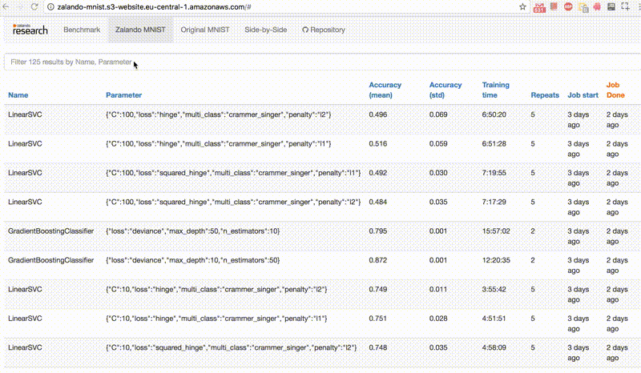
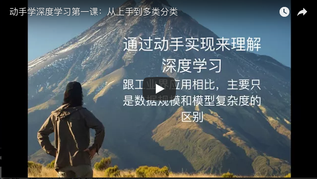
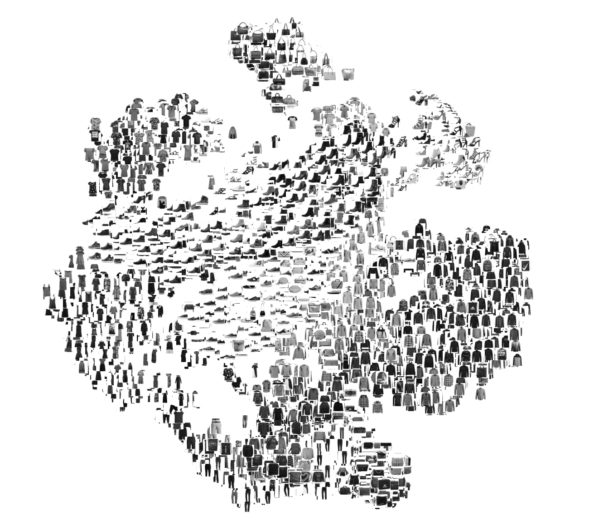
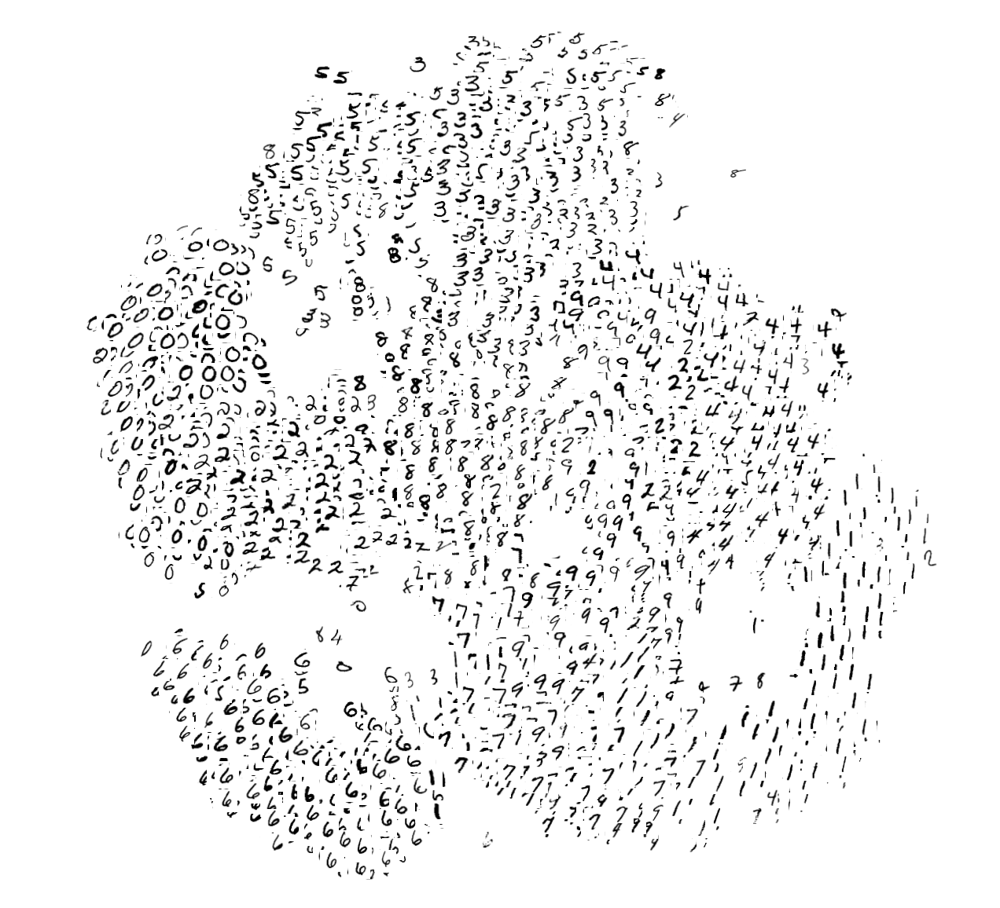
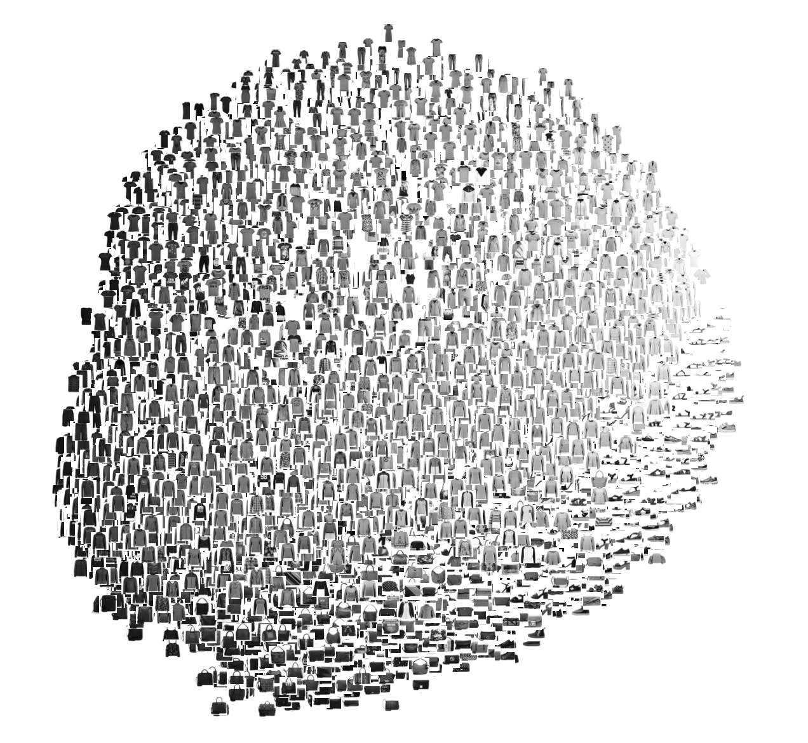
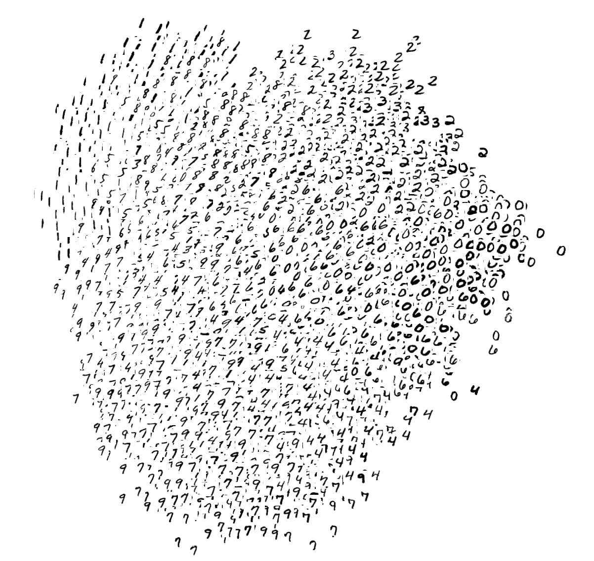
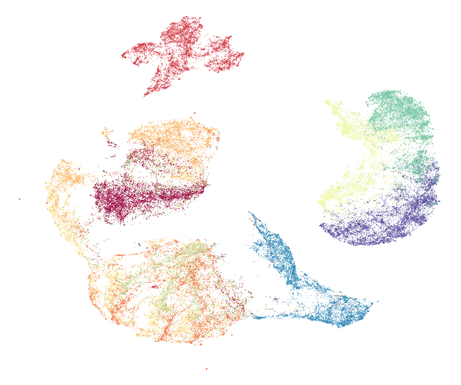
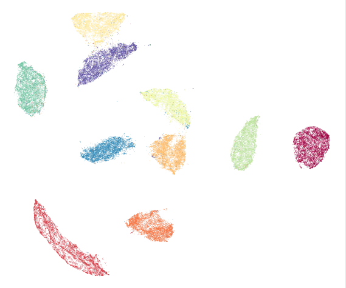
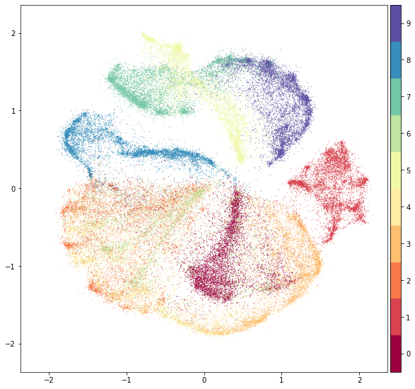
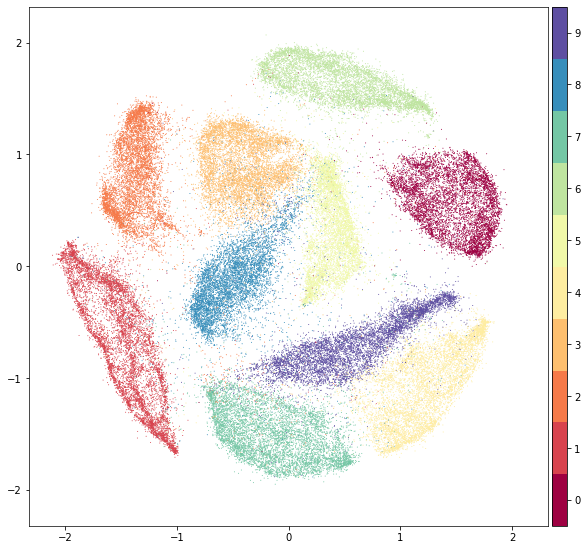

# Fashion-MNIST

[](https://github.com/zalandoresearch/fashion-mnist/)
[](https://gitter.im/fashion-mnist/Lobby?utm_source=share-link&utm_medium=link&utm_campaign=share-link)
[](README.md)
[](README.ja.md)
[](https://opensource.org/licenses/MIT)
[](https://hanxiao.github.io/2018/09/28/Fashion-MNIST-Year-In-Review/)

<details><summary>目录</summary><p>

* [为什么要做这个数据集？](#为什么要做这个数据集？)
* [获取数据](#获取数据)
* [如何载入数据？](#如何载入数据？)
* [基准测试](#基准测试)
* [数据可视化](#数据可视化)
* [参与贡献](#参与贡献)
* [联系](#联系)
* [在论文中引用Fashion-MNIST](#在论文中引用Fashion-MNIST)
* [License](#license)

</p></details><p></p>


`Fashion-MNIST`是一个替代[MNIST手写数字集](http://yann.lecun.com/exdb/mnist/)的图像数据集。 它是由Zalando（一家德国的时尚科技公司）旗下的[研究部门](https://research.zalando.com/)提供。其涵盖了来自10种类别的共7万个不同商品的正面图片。Fashion-MNIST的大小、格式和训练集/测试集划分与原始的MNIST完全一致。60000/10000的训练测试数据划分，28x28的灰度图片。你可以直接用它来测试你的机器学习和深度学习算法性能，且**不需要**改动任何的代码。

这个数据集的样子大致如下（每个类别占三行）：


## 为什么要做这个数据集？

[经典的MNIST数据集](http://yann.lecun.com/exdb/mnist/)包含了大量的手写数字。十几年来，来自机器学习、机器视觉、人工智能、深度学习领域的研究员们把这个数据集作为衡量算法的基准之一。你会在很多的会议，期刊的论文中发现这个数据集的身影。实际上，MNIST数据集已经成为算法作者的必测的数据集之一。有人曾调侃道：*"如果一个算法在MNIST不work, 那么它就根本没法用；而如果它在MNIST上work, 它在其他数据上也可能不work！"*
 

`Fashion-MNIST`的目的是要成为MNIST数据集的一个直接替代品。作为算法作者，你不需要修改任何的代码，就可以直接使用这个数据集。`Fashion-MNIST`的图片大小，训练、测试样本数及类别数与经典MNIST**完全相同**。

### 写给专业的机器学习研究者

我们是认真的。取代MNIST数据集的原因由如下几个：

- **MNIST太简单了。** 很多深度学习算法在测试集上的准确率已经达到99.6%！不妨看看[我们基于scikit-learn上对经典机器学习算法的评测](http://fashion-mnist.s3-website.eu-central-1.amazonaws.com/) 和这段代码： ["Most pairs of MNIST digits can be distinguished pretty well by just one pixel"（翻译：大多数MNIST只需要一个像素就可以区分开！）](https://gist.github.com/dgrtwo/aaef94ecc6a60cd50322c0054cc04478)
- **MNIST被用烂了。** 参考：["Ian Goodfellow wants people to move away from mnist"（翻译：Ian Goodfellow希望人们不要再用MNIST了。）](https://twitter.com/goodfellow_ian/status/852591106655043584)
- **MNIST数字识别的任务不代表现代机器学习。** 参考：["François Cholle: Ideas on MNIST do not transfer to real CV" （翻译：在MNIST上看似有效的想法没法迁移到真正的机器视觉问题上。）](https://twitter.com/fchollet/status/852592598128615424)

## 获取数据

[很多的机器学习库](#使用其它机器学习库)已经内置了Fashion-MNIST数据或接口，方便你直接使用。


你可以使用以下链接下载这个数据集。`Fashion-MNIST`的数据集的存储方式和命名与[经典MNIST数据集](http://yann.lecun.com/exdb/mnist/)完全一致。

| 名称  | 描述 | 样本数量 | 文件大小 | 链接 | MD5校验和|
| --- | --- |--- | --- |--- |--- |
| `train-images-idx3-ubyte.gz`  | 训练集的图像  | 60,000|26 MBytes | [下载](http://fashion-mnist.s3-website.eu-central-1.amazonaws.com/train-images-idx3-ubyte.gz)|`8d4fb7e6c68d591d4c3dfef9ec88bf0d`|
| `train-labels-idx1-ubyte.gz`  | 训练集的类别标签  |60,000|29 KBytes | [下载](http://fashion-mnist.s3-website.eu-central-1.amazonaws.com/train-labels-idx1-ubyte.gz)|`25c81989df183df01b3e8a0aad5dffbe`|
| `t10k-images-idx3-ubyte.gz`  | 测试集的图像  | 10,000|4.3 MBytes | [下载](http://fashion-mnist.s3-website.eu-central-1.amazonaws.com/t10k-images-idx3-ubyte.gz)|`bef4ecab320f06d8554ea6380940ec79`|
| `t10k-labels-idx1-ubyte.gz`  | 测试集的类别标签  | 10,000| 5.1 KBytes | [下载](http://fashion-mnist.s3-website.eu-central-1.amazonaws.com/t10k-labels-idx1-ubyte.gz)|`bb300cfdad3c16e7a12a480ee83cd310`|

或者，你可以直接克隆这个代码库。数据集就放在`data/fashion`下。这个代码库还包含了一些用于评测和可视化的脚本。
   
```bash
git clone git@github.com:zalandoresearch/fashion-mnist.git
```

### 类别标注
每个训练和测试样本都按照以下类别进行了标注：

| 标注编号 | 描述 |
| --- | --- |
| 0 | T-shirt/top（T恤）|
| 1 | Trouser（裤子）|
| 2 | Pullover（套衫）|
| 3 | Dress（裙子）|
| 4 | Coat（外套）|
| 5 | Sandal（凉鞋）|
| 6 | Shirt（汗衫）|
| 7 | Sneaker（运动鞋）|
| 8 | Bag（包）|
| 9 | Ankle boot（踝靴）|

## 如何载入数据？

### 使用Python (需要安装`numpy`)
- 你可以直接使用`utils/mnist_reader`：
```python
import mnist_reader
X_train, y_train = mnist_reader.load_mnist('data/fashion', kind='train')
X_test, y_test = mnist_reader.load_mnist('data/fashion', kind='t10k')
```

### 使用Tensorflow
请确保你已经[下载了我们的数据集](#获取数据)并把它放到了`data/fashion`下。不然， *Tensorflow会自动下载并使用原始的MNIST。*

```python
from tensorflow.examples.tutorials.mnist import input_data
data = input_data.read_data_sets('data/fashion')

data.train.next_batch(BATCH_SIZE)
```

注意，Tensorflow (master ver.) 支持向`read_data_sets`函数传入MNIST数据集的地址。你可以使用： 
```python
data = input_data.read_data_sets('data/fashion', source_url='http://fashion-mnist.s3-website.eu-central-1.amazonaws.com/')
```

Tensorflow的官网也提供了一份使用高级API`tf.keras`训练Fashion-MNIST的详细教程，[你可以在这里查看它](https://www.tensorflow.org/tutorials/keras/classification)。

### 使用其它机器学习库
截止今日，以下软件库中已内置了对`Fashion-MNIST`的支持。你只需要按照他们的文档载入`Fashion-MNIST`即可使用此数据集。
- [Apache MXNet Gluon](https://mxnet.apache.org/api/python/docs/api/gluon/data/vision/datasets/index.html#mxnet.gluon.data.vision.datasets.FashionMNIST)
- [TensorFlow.js](https://github.com/tensorflow/tfjs-examples/blob/master/fashion-mnist-vae/data.js)
- [Kaggle](https://www.kaggle.com/zalando-research/fashionmnist)
- [Pytorch](https://pytorch.org/vision/stable/datasets.html#fashion-mnist)
- [Keras](https://keras.io/api/datasets/fashion_mnist/)
- [Edward](http://edwardlib.org/api/observations/fashion_mnist)
- [Tensorflow](https://www.tensorflow.org/api_docs/python/tf/keras/datasets/fashion_mnist)
- [TensorFlow Datasets](https://www.tensorflow.org/datasets/catalog/fashion_mnist)
- [Torch](https://github.com/mingloo/fashion-mnist)
- [JuliaML](https://juliaml.github.io/MLDatasets.jl/latest/datasets/FashionMNIST/)
- [Chainer](https://docs.chainer.org/en/stable/reference/generated/chainer.datasets.get_fashion_mnist.html)
- [HuggingFace Datasets](https://huggingface.co/datasets/fashion_mnist)
- 
欢迎你同我们一起，为各个机器学习库增加对`Fashion-MNIST`的支持。


### 使用其它的语言

作为机器学习领域里最常使用的数据集，人们用各种语言为MNIST开发了很多载入工具。有一些方法需要先解压数据文件。注意，我们并没有测试过所有的载入方法。

- [C](https://stackoverflow.com/a/10409376)
- [C++](https://github.com/wichtounet/mnist)
- [Java](https://stackoverflow.com/a/8301949)
- [Python](https://pypi.python.org/pypi/python-mnist) and [this](https://pypi.python.org/pypi/mnist)
- [Scala](http://mxnet.io/tutorials/scala/mnist.html)
- [Go](https://github.com/schuyler/neural-go/blob/master/mnist/mnist.go)
- [C#](https://jamesmccaffrey.wordpress.com/2013/11/23/reading-the-mnist-data-set-with-c/)
- [NodeJS](https://github.com/ApelSYN/mnist_dl)和[这里](https://github.com/cazala/mnist)
- [Swift](https://github.com/simonlee2/MNISTKit)
- [R](https://gist.github.com/brendano/39760)和[这里](https://github.com/maddin79/darch)
- [Matlab](http://ufldl.stanford.edu/wiki/index.php/Using_the_MNIST_Dataset)
- [Ruby](https://github.com/gbuesing/mnist-ruby-test/blob/master/train/mnist_loader.rb)
- [Rust](https://github.com/AtheMathmo/vision-rs/blob/master/src/fashion_mnist.rs)


## 基准测试
我们使用`scikit-learn`做了一套自动评测系统。它涵盖了除深度学习之外的129种经典机器学习模型（包含不同的参数）。[你可以在这里以互动的方式查看结果。](http://fashion-mnist.s3-website.eu-central-1.amazonaws.com/)



你可以运行`benchmark/runner.py`对结果进行重现。而我们更推荐的方法是使用Dockerfile打包部署后以Container的方式运行。

我们欢迎你提交自己的模型评测。请使用Github新建一个Issue。不妨先看看[如何贡献](https://github.com/zalandoresearch/fashion-mnist#参与贡献)。如果你提交自己的模型，请先确保这个模型没有[在这个列表中](http://fashion-mnist.s3-website.eu-central-1.amazonaws.com/)被测试过。

下面这个表格总结了提交的一些测试结果。注意，**我们并没有对这些结果的准确性进行验证**。你可以通过提交者附带的代码尝试对结果进行重现。当然，测试准确率最终取决于Epoch的多少，Batch的大小等因素。如果你发现了下表中的不妥，欢迎提交新的Issue。

| 算法  | 预处理 | Fashion测试集准确率| 经典MNIST测试集准确率| 提交者| 代码|
| --- | --- | --- | --- | --- |--- |
|2 Conv+pooling | None | 0.876 | - | [Kashif Rasul](https://twitter.com/krasul) | [:link:](https://gist.github.com/kashif/76792939dd6f473b7404474989cb62a8) |
|2 Conv+pooling | None | 0.916| - |[Tensorflow's doc](https://www.tensorflow.org/tutorials/layers) | [:link:](/benchmark/convnet.py)|
|2 Conv+pooling+ELU activation (PyTorch)| None| 0.903| - | [@AbhirajHinge](https://github.com/AbhirajHinge) | [:link:](https://github.com/AbhirajHinge/CNN-with-Fashion-MNIST-dataset)|
|2 Conv | Normalization, random horizontal flip, random vertical flip, random translation, random rotation. | 0.919 |0.971 | [Kyriakos Efthymiadis](https://github.com/kefth)| [:link:](https://github.com/kefth/fashion-mnist)|
|2 Conv <100K parameters | None | 0.925 | 0.992 |[@hardmaru](https://twitter.com/hardmaru) | [:link:](https://github.com/hardmaru/pytorch_notebooks/blob/master/pytorch_tiny_custom_mnist_adam.ipynb)|
|2 Conv ~113K parameters | Normalization | 0.922| 0.993 |[Abel G.](https://github.com/abelusha) | [:link:](https://github.com/abelusha/MNIST-Fashion-CNN/blob/master/Fashon_MNIST_CNN_using_Keras_10_Runs.ipynb)|
|2 Conv+3 FC ~1.8M parameters| Normalization | 0.932 | 0.994 | [@Xfan1025](https://github.com/Xfan1025) |[:link:](https://github.com/Xfan1025/Fashion-MNIST/blob/master/fashion-mnist.ipynb) |
|2 Conv+3 FC ~500K parameters | Augmentation, batch normalization | 0.934 | 0.994 | [@cmasch](https://github.com/cmasch) |[:link:](https://github.com/cmasch/zalando-fashion-mnist) |
|2 Conv+pooling+BN | None | 0.934 | - | [@khanguyen1207](https://github.com/khanguyen1207) | [:link:](https://github.com/khanguyen1207/My-Machine-Learning-Corner/blob/master/Zalando%20MNIST/fashion.ipynb)|
|2 Conv+2 FC| Random Horizontal Flips|  0.939| -| [@ashmeet13](https://github.com/ashmeet13)|[:link:](https://github.com/ashmeet13/FashionMNIST-CNN)|
|3 Conv+2 FC | None | 0.907 | - | [@Cenk Bircanoğlu](https://github.com/cenkbircanoglu) | [:link:](https://github.com/cenkbircanoglu/openface/tree/master/fashion_mnist)|
|3 Conv+pooling+BN | None | 0.903 | 0.994 | [@meghanabhange](https://github.com/meghanabhange) | [:link:](https://github.com/meghanabhange/FashionMNIST-3-Layer-CNN) |
|3 Conv+pooling+2 FC+dropout | None | 0.926 | - | [@Umberto Griffo](https://github.com/umbertogriffo) | [:link:](https://github.com/umbertogriffo/Fashion-mnist-cnn-keras)|
|3 Conv+BN+pooling|None|0.921|0.992|[@gchhablani](https://github.com/gchhablani)|[:link:](https://github.com/gchhablani/CNN-with-FashionMNIST)| 
|5 Conv+BN+pooling|None|0.931|-|[@Noumanmufc1](https://github.com/Noumanmufc1)|[:link:](https://gist.github.com/Noumanmufc1/60f00e434f0ce42b6f4826029737490a)| 
|CNN with optional shortcuts, dense-like connectivity| standardization+augmentation+random erasing | 0.947 |-| [@kennivich](https://github.com/Dezhic) | [:link:](https://github.com/Dezhic/fashion-classifier)|
|GRU+SVM | None| 0.888 | 0.965 | [@AFAgarap](https://github.com/AFAgarap) | [:link:](https://gist.githubusercontent.com/AFAgarap/92c1c4a5dd771999b0201ec0e7edfee0/raw/828fbda0e466dacb1fad66549e0e3022e1c7263a/gru_svm_zalando.py)|
|GRU+SVM with dropout | None| 0.897 | 0.988 | [@AFAgarap](https://github.com/AFAgarap) | [:link:](https://gist.githubusercontent.com/AFAgarap/92c1c4a5dd771999b0201ec0e7edfee0/raw/58dbe7cd8b0d83e4386cd6896766113b1a9af096/gru_svm_zalando_dropout.py)|
|WRN40-4 8.9M params | standard preprocessing (mean/std subtraction/division) and augmentation (random crops/horizontal flips)| 0.967 | - |[@ajbrock](https://github.com/ajbrock) | [:link:](https://github.com/xternalz/WideResNet-pythttps://gist.githubusercontent.com/AFAgarap/92c1c4a5dd771999b0201ec0e7edfee0/raw/58dbe7cd8b0d83e4386cd6896766113b1a9af096/gru_svm_zalando_dropout.pyorch)  [:link:](https://github.com/ajbrock/FreezeOut) |
|DenseNet-BC 768K params| standard preprocessing (mean/std subtraction/division) and augmentation (random crops/horizontal flips) | 0.954 | - |[@ajbrock](https://github.com/ajbrock)  | [:link:](https://github.com/bamos/densenet.pytorch)  [:link:](https://github.com/ajbrock/FreezeOut) |
|MobileNet | augmentation (horizontal flips)| 0.950|- | [@苏剑林](https://github.com/bojone)| [:link:](http://kexue.fm/archives/4556/)|
|ResNet18 | Normalization, random horizontal flip, random vertical flip, random translation, random rotation. | 0.949 | 0.979 |[Kyriakos Efthymiadis](https://github.com/kefth)| [:link:](https://github.com/kefth/fashion-mnist)|
|GoogleNet with cross-entropy loss | None | 0.937 | - | [@Cenk Bircanoğlu](https://github.com/cenkbircanoglu) | [:link:](https://github.com/cenkbircanoglu/openface/tree/master/fashion_mnist)|
|AlexNet with Triplet loss| None | 0.899 | - | [@Cenk Bircanoğlu](https://github.com/cenkbircanoglu) | [:link:](https://github.com/cenkbircanoglu/openface/tree/master/fashion_mnist)|
|SqueezeNet with cyclical learning rate 200 epochs| None| 0.900| - | [@snakers4](https://github.com/snakers4) | [:link:](https://github.com/zalandoresearch/fashion-mnist/files/1263340/squeeze_net_mnist.zip)|
|Dual path network with wide resnet 28-10|standard preprocessing (mean/std subtraction/division) and augmentation (random crops/horizontal flips) |0.957|-|[@Queequeg](https://github.com/Queequeg92)|[:link:](https://github.com/Queequeg92/DualPathNet)|
|MLP 256-128-100| None | 0.8833| - | [@heitorrapela](https://github.com/heitorrapela)| [:link:](https://github.com/heitorrapela/fashion-mnist-mlp)|
|VGG16 26M parameters | None | 0.935| - | [@QuantumLiu](https://github.com/QuantumLiu)|[:link:](https://github.com/QuantumLiu/fashion-mnist-demo-by-Keras) [:link:](https://zhuanlan.zhihu.com/p/28968219)|
|WRN-28-10| standard preprocessing (mean/std subtraction/division) and augmentation (random crops/horizontal flips) | 0.959 | -| [@zhunzhong07](https://github.com/zhunzhong07)|[:link:](https://github.com/zhunzhong07/Random-Erasing)|
|WRN-28-10 + Random Erasing| standard preprocessing (mean/std subtraction/division) and augmentation (random crops/horizontal flips) | 0.963 | -| [@zhunzhong07](https://github.com/zhunzhong07)|[:link:](https://github.com/zhunzhong07/Random-Erasing)|
|Human Performance| Crowd-sourced evaluation of human (with no fashion expertise) performance. 1000 randomly sampled test images, 3 labels per image, majority labelling. | 0.835 | - | Leo  | - 
|Capsule Network 8M parameters| Normalization and shift at most 2 pixel and horizontal flip | 0.936 | - | [@XifengGuo](https://github.com/XifengGuo)  | [:link:](https://github.com/XifengGuo/CapsNet-Fashion-MNIST)|
|HOG+SVM| HOG | 0.926 | - | [@subalde](https://github.com/subalde) | [:link:](https://github.com/subalde/fashion-mnist)|
|XgBoost| scaling the pixel values to mean=0.0 and var=1.0| 0.898| 0.958| [@anktplwl91](https://github.com/anktplwl91)| [:link:](https://github.com/anktplwl91/fashion_mnist.git)|
|DENSER| - | 0.953| 0.997| [@fillassuncao](https://github.com/fillassuncao)| [:link:](https://github.com/fillassuncao/denser-models) [:link:](https://arxiv.org/pdf/1801.01563.pdf)|
|Dyra-Net| Rescale to unit interval | 0.906| -| [@Dirk Schäfer](https://github.com/disc5)| [:link:](https://github.com/disc5/dyra-net) [:link:](https://dl.acm.org/citation.cfm?id=3204176.3204200)|
|Google AutoML|24 compute hours (higher quality)| 0.939|-| [@Sebastian Heinz](https://github.com/sebastianheinz) |[:link:](https://www.statworx.com/de/blog/a-performance-benchmark-of-google-automl-vision-using-fashion-mnist/)|
|Fastai| Resnet50+Fine-tuning+Softmax on last layer's activations| 0.9312| - | [@Sayak](https://github.com/sayakpaul) | [:link:](https://github.com/sayakpaul/Experiments-on-Fashion-MNIST/)|
### 更多在Fashion-MNIST上的探索和尝试

#### [Fashion-MNIST: 年度总结](https://hanxiao.github.io/2018/09/28/Fashion-MNIST-Year-In-Review/)
#### [在Google Scholar中查看引用Fashion-MNIST的论文](https://scholar.google.de/scholar?hl=en&as_sdt=0%2C5&q=fashion-mnist&btnG=&oq=fas) 

#### 生成对抗网络 (GANs) 
- [Tensorflow implementation of various GANs and VAEs.](https://github.com/hwalsuklee/tensorflow-generative-model-collections) (**推荐阅读！** 注意不同GANs的算法在Fashion-MNIST上生成的样本明显不同，而这点在经典的MNIST数据集上是观察不到的。)
- [Make a ghost wardrobe using DCGAN](https://twitter.com/spaceLenny/status/901488938023403520)
- [fashion-mnist的gan玩具](http://kexue.fm/archives/4540/)
- [CGAN output after 5000 steps](https://github.com/a7b23/Conditional-GAN-using-tensorflow-slim)
- [GAN Playground - Explore Generative Adversarial Nets in your Browser](https://reiinakano.github.io/gan-playground/)

#### 聚类
- [Xifeng Guo's implementation](https://github.com/XifengGuo/DEC-keras) of [Unsupervised Deep Embedding for Clustering Analysis (DEC)](http://proceedings.mlr.press/v48/xieb16.pdf)
- [Leland McInnes's](https://github.com/lmcinnes) [Uniform Manifold Approximation and Projection (UMAP)](https://github.com/lmcinnes/umap)


#### 视频教程
*Machine Learning Meets Fashion* by [Yufeng G](https://twitter.com/yufengg) @ Google Cloud

[](https://youtu.be/RJudqel8DVA)

*Introduction to Kaggle Kernels* by [Yufeng G](https://twitter.com/yufengg) @ Google Cloud

[](https://youtu.be/FloMHMOU5Bs)

*动手学深度学习* by Mu Li @ Amazon AI

[](https://youtu.be/kGktiYF5upk)

Apache MXNet으로 배워보는 딥러닝(Deep Learning) - 김무현 (AWS 솔루션즈아키텍트)

[](https://youtu.be/H66GDuLsGl4)


## 数据可视化

### t-SNE在Fashion-MNIST(左侧)和经典MNIST上的可视化(右侧) 


### PCA在Fashion-MNIST(左侧)和经典MNIST上的可视化(右侧) 


### [UMAP](https://github.com/lmcinnes/umap)在Fashion-MNIST(左侧)和经典MNIST上的可视化(右侧)  


### [PyMDE](https://github.com/cvxgrp/pymde)在Fashion-MNIST(左侧)和经典MNIST上的可视化(右侧)  


## 参与贡献
我们热烈欢迎您参与贡献这个项目。[请先阅读这里！](/CONTRIBUTING.md) 并查看有什么[open issues](https://github.com/zalandoresearch/fashion-mnist/issues)可以帮助解决。

## 联系
若要讨论这个数据集上的应用和评测，请使用这个聊天室[](https://gitter.im/fashion-mnist/Lobby?utm_source=share-link&utm_medium=link&utm_campaign=share-link)


## 在论文中引用Fashion-MNIST
如果你在你的研究工作中使用了这个数据集，欢迎你引用这篇论文：

**Fashion-MNIST: a Novel Image Dataset for Benchmarking Machine Learning Algorithms. Han Xiao, Kashif Rasul, Roland Vollgraf. [arXiv:1708.07747](http://arxiv.org/abs/1708.07747)**

亦可使用Biblatex:
```latex
@online{xiao2017/online,
  author       = {Han Xiao and Kashif Rasul and Roland Vollgraf},
  title        = {Fashion-MNIST: a Novel Image Dataset for Benchmarking Machine Learning Algorithms},
  date         = {2017-08-28},
  year         = {2017},
  eprintclass  = {cs.LG},
  eprinttype   = {arXiv},
  eprint       = {cs.LG/1708.07747},
}
```

[有谁引用了Fashion-MNIST?](https://scholar.google.com/scholar?scisbd=2&q=%22fashion-mnist%22&hl=en&as_sdt=0,5) 


## License

The MIT License (MIT) Copyright © [2017] Zalando SE, https://tech.zalando.com

Permission is hereby granted, free of charge, to any person obtaining a copy of this software and associated documentation files (the “Software”), to deal in the Software without restriction, including without limitation the rights to use, copy, modify, merge, publish, distribute, sublicense, and/or sell copies of the Software, and to permit persons to whom the Software is furnished to do so, subject to the following conditions:

The above copyright notice and this permission notice shall be included in all copies or substantial portions of the Software.

THE SOFTWARE IS PROVIDED “AS IS”, WITHOUT WARRANTY OF ANY KIND, EXPRESS OR IMPLIED, INCLUDING BUT NOT LIMITED TO THE WARRANTIES OF MERCHANTABILITY, FITNESS FOR A PARTICULAR PURPOSE AND NONINFRINGEMENT. IN NO EVENT SHALL THE AUTHORS OR COPYRIGHT HOLDERS BE LIABLE FOR ANY CLAIM, DAMAGES OR OTHER LIABILITY, WHETHER IN AN ACTION OF CONTRACT, TORT OR OTHERWISE, ARISING FROM, OUT OF OR IN CONNECTION WITH THE SOFTWARE OR THE USE OR OTHER DEALINGS IN THE SOFTWARE.
